### Hi there 👋

<dl>
  <dt>
    
  </dt>
  <dt>
    
  </dt>
  <dt>
    <!--
    
    -->
  </dt>
  <dt>
    
  </dt>
</dl>

<!--  -->
<!--  -->
<!-- 📊
### Hi there 👋

**MareMare/MareMare** is a ✨ _special_ ✨ repository because its `README.md` (this file) appears on your GitHub profile.
Here are some ideas to get you started:

- 🔭 I’m currently working on ...
- 🌱 I’m currently learning ...
- 👯 I’m looking to collaborate on ...
- 🤔 I’m looking for help with ...
- 💬 Ask me about ...
- 📫 How to reach me: ...
- 😄 Pronouns: ...
- ⚡ Fun fact: ...
-->

<!--
### Hi there 👋

- 👋 Hi, I’m @MareMare
- 👀 I’m interested in ...
- 🌱 I’m currently learning ...
- 💞️ I’m looking to collaborate on ...
- 📫 How to reach me ...
-->
